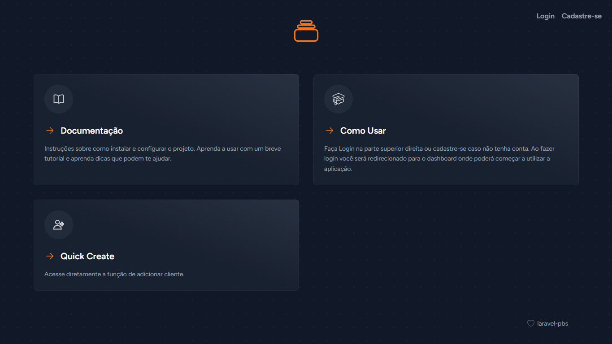
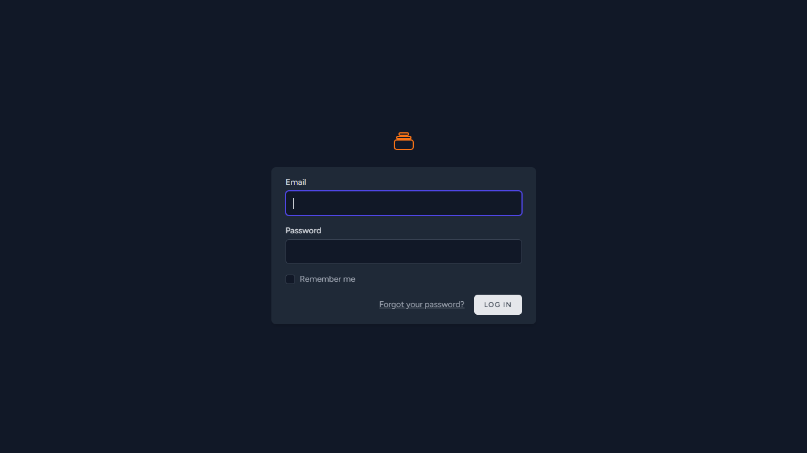
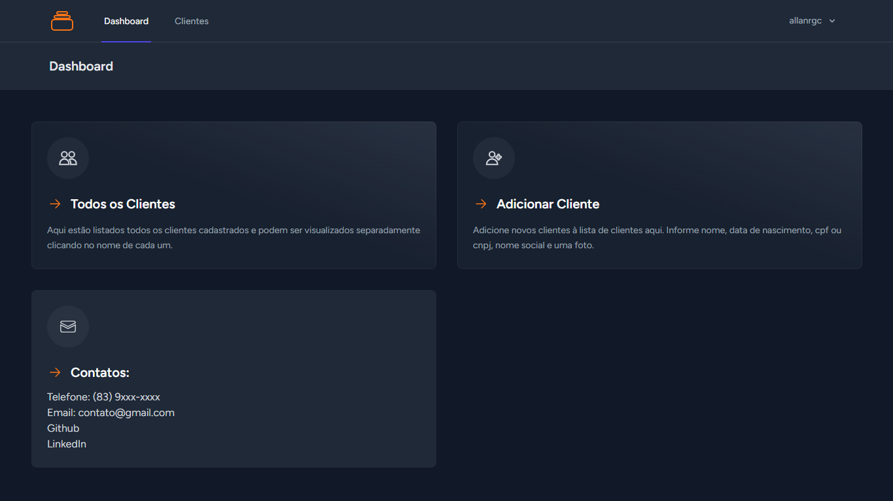
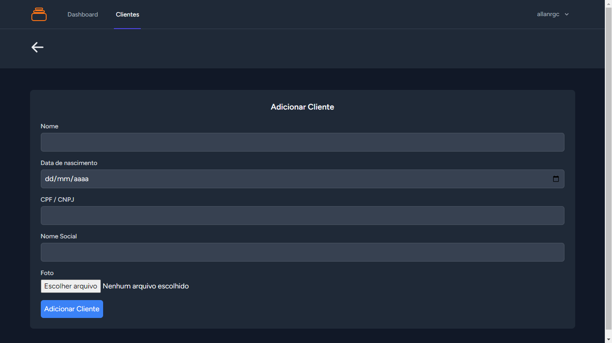

# Clients Manager

[](LICENSE)
[](https://github.com/allanrgc/laravel-pbs/issues)
[](https://github.com/allanrgc/laravel-pbs/stargazers)

Bem-vindo à aplicação de gerenciamento de clientes feito com php com Laravel e React Inertia. Com esta aplicação você pode criar e gerenciar uma lista de clientes que possuam informações como (nome, data de nascimento, cpf/cnpj, nome da empresa, foto). Aplicação em desenvolvimento.

## Capturas de Tela

### Tela Inicial


### Tela de Login 


### Tela de Dashboard


### Tela de Adicionar Cliente


## Instalação

1. Clone este repositório para o seu computador:
```bash
git clone https://github.com/allanrgc/
```

2. Navegue até o diretório do projeto:
```bash
cd seu-repositorio
```

3. Instale as dependências do projeto:
```bash
npm install
```

4. Inicie o aplicativo
```bash
php artisan serve
```

## Como usar
Faça Login na parte superior direita ou cadastre-se caso não tenha conta.
                                Ao fazer login você será redirecionado para o dashboard onde poderá começar
                                a utilizar a aplicação.

## ...

- Fork o repositório.
- Crie um novo branch: git checkout -b sua-branch
- Faça suas alterações e as confirme: git commit -m 'Adicionar alguma alteração legal'.
- Envie para o branch: git push origin sua-branch
- Solicite um PR.

## Requisitos

Certifique-se de ter as seguintes dependências instaladas:

- PHP: ^8.1
- Guzzle HTTP: ^7.2
- Inertia.js para Laravel: ^0.6.3
- Laravel Breeze: ^1.26
- Laravel Framework: ^10.10
- Laravel Sanctum: ^3.2
- Laravel Tinker: ^2.8
- Spatie Laravel Media Library: ^10.15
- TightenCo Ziggy: ^1.0

## License
Este projeto está licenciado sob a Licença MIT - consulte o arquivo LICENSE para obter detalhes.


```bash
Feel free to customize the template to fit the specific details and needs of your project. Include relevant badges, images, or GIFs to make your README visually appealing and informative.
```
